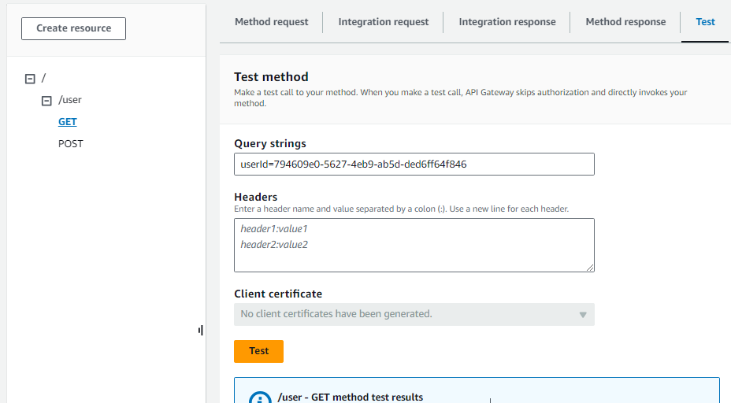

# aws-sam-lambda-dynamodb-api
Simple Java Project to build AWS Serverless API using SAM.
There are two REST endpoints exposed:
* Add UserData
* Get UserData
Each of the endpoints are backed by Lambda function to store and retrieve UserData.

## Steps to Build and Deploy
**Build Project**
```
# sam build
```

Deploy
```
# sam deploy --guided
```

When completed you will see 2 Cloud Formation stacks.
* **aws-sam-cli-managed-default**:  For S3 Bucket and policy to upload zipped code
* your application stack: with all the resources created as defined in 'template.yaml'

After changeset is deployed. You will see all the resources created and corresponding event in CloudFormation.

## Testing
Goto AWS Api Gateway (you can click the created API Gateway in Cloud Formation --> Resources)

### POST: User Data


### GET: User Data
** use the userID from POST Request




